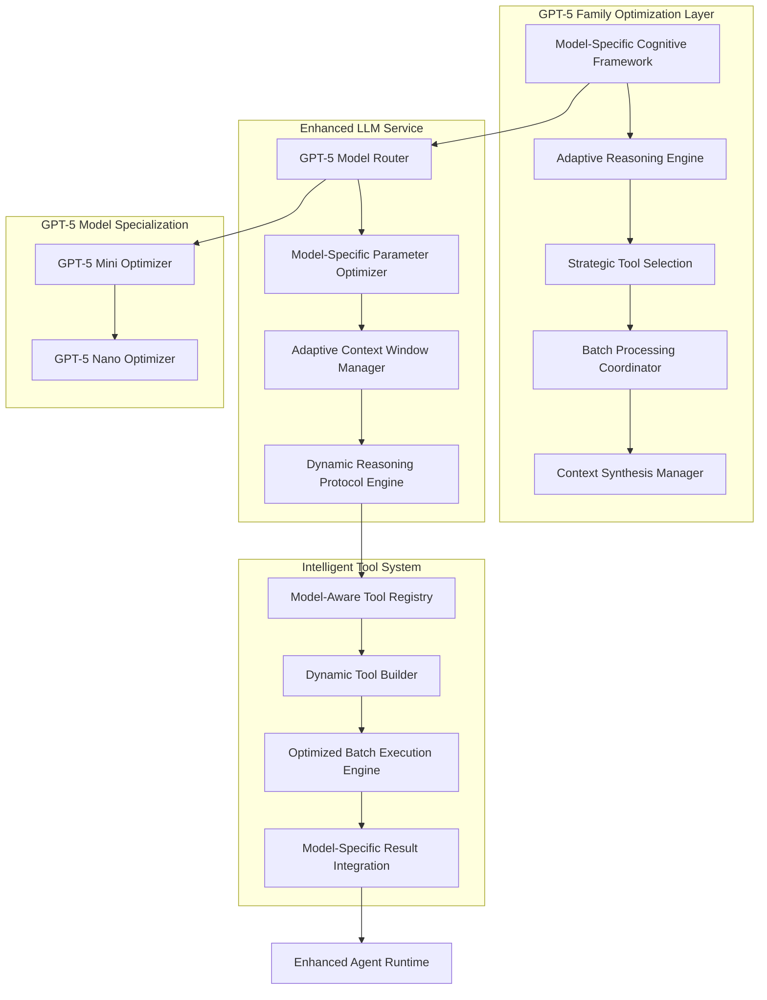
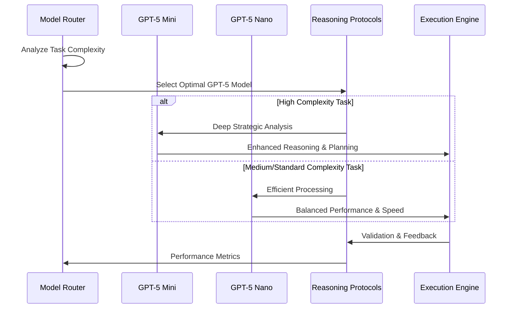
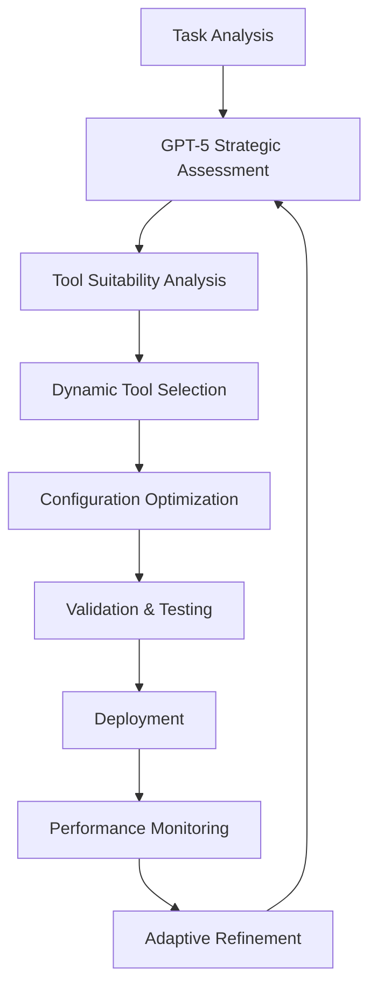

# GPT-5 Family Prompt and Tool Function Optimization Design

## Overview

This design document outlines a comprehensive optimization strategy for maximizing LLM prompts and tool functions exclusively for GPT-5 family models (GPT-5 Mini and GPT-5 Nano) within the DimaticTexo platform. The optimization leverages each model's unique cognitive capabilities, context windows, and specialized strengths to achieve superior performance in agent execution and tool utilization.

## Technology Stack & Dependencies

- **Backend**: Python 3.x, FastAPI
- **LLM Integration**: LiteLLM v1.75.2 with GPT-5 support
- **Agent System**: AgentPress framework
- **Tool Registry**: Custom tool registration system
- **Database**: Supabase (PostgreSQL)
- **Caching**: Redis for session management

## Architecture

### GPT-5 Family Enhanced System Architecture



### GPT-5 Family Cognitive Excellence Framework

The system implements sophisticated cognitive frameworks designed specifically for each GPT-5 model's unique capabilities:

#### GPT-5 Mini Optimizations
- **Enhanced Reasoning Depth**: Leverages GPT-5 Mini's superior reasoning capabilities for complex problem-solving
- **Priority Service Tier**: Automatically requests priority service tier for consistent performance
- **Advanced Context Synthesis**: Utilizes 200K+ token context for comprehensive analysis
- **Strategic Planning Excellence**: Maximizes Mini's strategic thinking capabilities

#### GPT-5 Nano Optimizations
- **Efficiency-First Approach**: Optimized for speed while maintaining reasoning quality
- **Resource-Conscious Processing**: Intelligent resource allocation for cost-effective operations
- **Streamlined Context Management**: Focused context utilization for rapid processing
- **Balanced Performance Strategy**: Optimal balance between speed and analytical depth
- **Smart Resource Allocation**: Maximizes Nano's efficiency advantages

#### Multi-Model Dimensional Analysis Engine
- **Strategic Decomposition**: Model-specific task breakdown optimized for each variant's strengths
- **Adaptive Context Synthesis**: Dynamic context window utilization based on model capabilities
- **Parallel Processing**: Intelligent workload distribution across model variants
- **Model-Aware Self-Validation**: Tailored validation protocols for each model's characteristics
- **Dynamic Strategy Adaptation**: Real-time strategy adjustment based on model performance

#### Advanced Reasoning Protocols for GPT-5 Family



## Enhanced System Prompts for GPT-5 Family

### Model-Specific Cognitive Framework Prompts

The system implements tailored prompts for each model variant to maximize their unique strengths:

#### GPT-5 Mini Framework Prompt

```markdown
# GPT-5 MINI COGNITIVE EXCELLENCE FRAMEWORK

## ADVANCED REASONING ARCHITECTURE
**Multi-Dimensional Analysis**: Leverage GPT-5 Mini's enhanced cognitive abilities for:
- **Strategic Decomposition**: Break complex tasks into logical, executable components
- **Context Synthesis**: Utilize 200K+ token context for comprehensive understanding
- **Priority Processing**: Access priority service tier for consistent performance
- **Self-Validation**: Continuously verify outputs using advanced error detection
- **Adaptive Planning**: Dynamically adjust strategies based on emerging insights

## GPT-5 MINI REASONING PROTOCOLS
**Before Every Action**:
1. **Deep Situation Analysis**: What is the current state and desired outcome?
2. **Strategic Formation**: What approach leverages available resources most effectively?
3. **Comprehensive Resource Planning**: What tools, information, and steps are needed?
4. **Advanced Risk Assessment**: What could go wrong and how to mitigate?
5. **Success Metrics**: How will we measure and validate success?
```

#### GPT-5 Nano Framework Prompt

```markdown
# GPT-5 NANO EFFICIENCY FRAMEWORK

## OPTIMIZED REASONING ARCHITECTURE
**Efficient Analysis**: Leverage GPT-5 Nano's balanced capabilities for:
- **Streamlined Decomposition**: Break tasks efficiently while maintaining quality
- **Focused Context Usage**: Optimize context utilization for speed and accuracy
- **Resource-Conscious Processing**: Balance performance with efficiency
- **Quick Validation**: Rapid but thorough output verification
- **Agile Planning**: Fast strategy adaptation with maintained effectiveness

## GPT-5 NANO REASONING PROTOCOLS
**Before Every Action**:
1. **Efficient Situation Analysis**: Quick but comprehensive state assessment
2. **Optimized Strategy Formation**: Balanced approach prioritizing speed and quality
3. **Smart Resource Planning**: Efficient allocation of tools and information
4. **Rapid Risk Assessment**: Quick identification and mitigation strategies
5. **Streamlined Success Metrics**: Fast but accurate progress measurement
```

### Context-Aware Progressive Prompting

Implements progressive detail building that utilizes GPT-5's large context window:

- **Phase 1**: High-level strategic analysis
- **Phase 2**: Detailed component breakdown
- **Phase 3**: Resource allocation and tool selection
- **Phase 4**: Execution planning with contingencies
- **Phase 5**: Validation and optimization strategies

## Advanced Tool Function Optimization for GPT-5 Family

### GPT-5 Model-Aware Intelligent Tool Descriptions

Enhanced tool descriptions that adapt based on the specific GPT-5 model being used:

```python
@openapi_schema({
    "type": "function",
    "function": {
        "name": "enhanced_file_operations",
        "description": "GPT-5 family optimized file management with adaptive strategic analysis. GPT-5 Mini: Deep file relationship analysis with comprehensive planning. GPT-5 Nano: Efficient file operations with balanced performance and speed.",
        "parameters": {
            "type": "object",
            "properties": {
                "model_optimization_level": {
                    "type": "string",
                    "enum": ["gpt5_mini_comprehensive", "gpt5_nano_efficient"],
                    "description": "GPT-5 model-specific optimization: gpt5_mini_comprehensive for deep analysis, gpt5_nano_efficient for balanced performance"
                },
                "operation_strategy": {
                    "type": "string",
                    "enum": ["conservative", "optimized", "aggressive"],
                    "description": "Strategic approach adapted to GPT-5 model capabilities"
                },
                "batch_operations": {
                    "type": "array",
                    "items": {"type": "object"},
                    "description": "GPT-5 optimized batch operations with intelligent dependency analysis"
                },
                "context_utilization": {
                    "type": "string",
                    "enum": ["minimal", "standard", "extensive", "maximum"],
                    "description": "Context window utilization strategy based on GPT-5 model capabilities"
                }
            }
        }
    }
})
```

### Model-Specific Batch Processing Capabilities

Leverages each model's unique strengths for optimized batch operations:

#### Multi-Model Strategic Batch Execution

```python
class MultiModelBatchProcessor:
    """
    Advanced batch processing designed for GPT-5/6 family models.
    Adapts batch strategies based on model capabilities and characteristics.
    """
    
    def __init__(self):
        self.model_strategies = {
            "gpt-5-mini": {
                "batch_size": "large",
                "analysis_depth": "comprehensive",
                "context_utilization": "maximum",
                "reasoning_approach": "deep_strategic"
            },
            "gpt-5-nano": {
                "batch_size": "medium",
                "analysis_depth": "balanced",
                "context_utilization": "efficient",
                "reasoning_approach": "streamlined_effective"
            },
            "gpt-6-nano": {
                "batch_size": "adaptive",
                "analysis_depth": "predictive",
                "context_utilization": "intelligent",
                "reasoning_approach": "next_gen_anticipatory"
            }
        }
    
    async def optimize_batch_for_model(self, operations: List[Dict], model: str, context: Dict) -> Dict:
        """
        Optimizes batch execution strategy based on specific model capabilities.
        """
        strategy = self.model_strategies.get(model, self.model_strategies["gpt-5-nano"])
        
        return {
            "execution_plan": await self._create_model_specific_plan(operations, strategy),
            "resource_allocation": await self._optimize_resources_for_model(operations, strategy, context),
            "validation_strategy": await self._design_model_validation(operations, strategy),
            "performance_optimization": await self._apply_model_optimizations(operations, strategy)
        }
```

### Enhanced Tool Registry with GPT-5 Intelligence

```python
class GPT5ToolRegistry(ToolRegistry):
    """
    Intelligent tool registry optimized for GPT-5's advanced reasoning capabilities.
    Provides strategic tool selection and dynamic optimization.
    """
    
    def __init__(self):
        super().__init__()
        self.gpt5_optimizations = {
            "strategic_selection": True,
            "context_awareness": True,
            "batch_optimization": True,
            "adaptive_parameters": True
        }
    
    async def select_optimal_tools(self, task_analysis: Dict, context: Dict) -> List[Dict]:
        """
        Uses GPT-5's reasoning to select the most effective tool combination.
        Considers task complexity, resource availability, and success probability.
        """
        tool_candidates = await self._analyze_tool_suitability(task_analysis)
        optimization_strategy = await self._determine_strategy(task_analysis, context)
        
        return await self._optimize_tool_selection(
            candidates=tool_candidates,
            strategy=optimization_strategy,
            context=context
        )
```

## Context Window Optimization

### Large Context Utilization Strategies

Maximizes GPT-5's 200K+ token context window for comprehensive analysis:

#### Progressive Context Building


#### Context Synthesis Patterns

- **Information Layering**: Builds context progressively from general to specific
- **Cross-Reference Analysis**: Links related information across large context spans
- **Pattern Recognition**: Identifies trends and relationships in extended contexts
- **Strategic Filtering**: Prioritizes most relevant information for current objectives

### Memory-Efficient Context Management

```python
class GPT5ContextManager:
    """
    Advanced context management for GPT-5's large context window.
    Implements intelligent context synthesis and optimization.
    """
    
    def __init__(self, max_tokens: int = 200000):
        self.max_tokens = max_tokens
        self.context_layers = {
            "strategic": 0.3,  # 30% for strategic planning
            "operational": 0.4,  # 40% for operational details
            "historical": 0.2,  # 20% for historical context
            "adaptive": 0.1   # 10% for adaptive adjustments
        }
    
    async def synthesize_context(self, components: List[Dict]) -> Dict:
        """
        Synthesizes context components into optimal structure for GPT-5 processing.
        Prioritizes information based on relevance and strategic importance.
        """
        return {
            "structured_context": await self._structure_information(components),
            "priority_mapping": await self._calculate_priorities(components),
            "synthesis_strategy": await self._determine_synthesis_approach(components)
        }
```

## LLM Service Enhancements

### GPT-5 Specific Parameter Optimization

Enhanced parameter handling for GPT-5 models with advanced configuration:

```python
def prepare_gpt5_params(
    messages: List[Dict[str, Any]],
    model_name: str,
    optimization_level: str = "maximum",
    reasoning_depth: str = "comprehensive",
    context_synthesis: bool = True,
    **kwargs
) -> Dict[str, Any]:
    """
    Prepares optimized parameters specifically for GPT-5 models.
    Implements advanced configuration for maximum performance.
    """
    
    base_params = {
        "model": model_name,
        "messages": messages,
        "service_tier": "priority",  # Always use priority tier for GPT-5
        "reasoning_effort": reasoning_depth,
        "temperature": 1.0,  # GPT-5 default requirement
    }
    
    # GPT-5 specific optimizations
    if "gpt-5" in model_name.lower():
        gpt5_enhancements = {
            "strategic_planning": True,
            "context_synthesis": context_synthesis,
            "adaptive_reasoning": optimization_level in ["high", "maximum"],
            "batch_processing": True,
            "validation_protocols": "comprehensive"
        }
        base_params.update(gpt5_enhancements)
    
    return base_params
```

### Enhanced Error Handling and Fallback

Implements intelligent error handling designed for GPT-5's self-correction capabilities:

```python
async def gpt5_enhanced_api_call(
    params: Dict[str, Any],
    max_retries: int = 3,
    enable_self_correction: bool = True
) -> Union[Dict[str, Any], AsyncGenerator]:
    """
    Enhanced API call with GPT-5 specific error handling and self-correction.
    Leverages GPT-5's advanced error detection and recovery capabilities.
    """
    
    for attempt in range(max_retries):
        try:
            response = await litellm.acompletion(**params)
            
            if enable_self_correction:
                validated_response = await validate_gpt5_response(response, params)
                if validated_response.get("needs_correction"):
                    params = await enhance_params_with_correction(params, validated_response)
                    continue
            
            return response
            
        except Exception as error:
            correction_strategy = await analyze_error_with_gpt5(error, params, attempt)
            if correction_strategy:
                params = await apply_correction_strategy(params, correction_strategy)
            else:
                await handle_error(error, attempt, max_retries)
```

## Agent Builder Integration

### GPT-5 Optimized Agent Configuration

Enhanced agent configuration system that leverages GPT-5's strategic planning:

```python
class GPT5AgentBuilder:
    """
    Advanced agent builder optimized for GPT-5's cognitive capabilities.
    Implements intelligent agent configuration and optimization.
    """
    
    def __init__(self):
        self.gpt5_strategies = {
            "reasoning_frameworks": [
                "multi_dimensional_analysis",
                "strategic_decomposition",
                "context_synthesis",
                "adaptive_planning"
            ],
            "optimization_levels": {
                "conservative": {"reasoning_effort": "low", "validation": "basic"},
                "balanced": {"reasoning_effort": "medium", "validation": "comprehensive"},
                "maximum": {"reasoning_effort": "high", "validation": "exhaustive"}
            }
        }
    
    async def create_gpt5_optimized_agent(self, requirements: Dict) -> Dict:
        """
        Creates agent configuration optimized for GPT-5's capabilities.
        Implements strategic tool selection and reasoning frameworks.
        """
        return {
            "system_prompt": await self._generate_gpt5_prompt(requirements),
            "tool_configuration": await self._optimize_tool_selection(requirements),
            "reasoning_framework": await self._select_reasoning_strategy(requirements),
            "context_management": await self._configure_context_strategy(requirements)
        }
```

### Dynamic Tool Configuration

Implements intelligent tool configuration that adapts based on GPT-5's analysis:



## Performance Optimization Strategies

### Intelligent Caching and Memoization

Leverages GPT-5's pattern recognition for intelligent caching strategies:

```python
class GPT5IntelligentCache:
    """
    Advanced caching system that uses GPT-5's pattern recognition
    to optimize cache strategies and predict future needs.
    """
    
    def __init__(self):
        self.cache_strategies = {
            "predictive": self._predictive_caching,
            "pattern_based": self._pattern_based_caching,
            "context_aware": self._context_aware_caching
        }
    
    async def optimize_cache_strategy(self, usage_patterns: Dict, context: Dict) -> Dict:
        """
        Uses GPT-5 analysis to optimize caching strategies based on usage patterns.
        Implements predictive caching for improved performance.
        """
        analysis = await self._analyze_patterns_with_gpt5(usage_patterns, context)
        return await self._generate_cache_strategy(analysis)
```

### Resource Allocation Optimization

Implements dynamic resource allocation based on GPT-5's strategic planning:

```python
class GPT5ResourceOptimizer:
    """
    Intelligent resource allocation system that uses GPT-5's strategic
    planning to optimize compute resources and execution priorities.
    """
    
    async def optimize_resource_allocation(self, tasks: List[Dict], resources: Dict) -> Dict:
        """
        Uses GPT-5's strategic planning to optimize resource allocation
        across multiple tasks and execution contexts.
        """
        return {
            "allocation_strategy": await self._plan_resource_distribution(tasks, resources),
            "priority_matrix": await self._calculate_task_priorities(tasks),
            "optimization_opportunities": await self._identify_optimizations(tasks, resources)
        }
```

## Testing Strategy

### GPT-5 Specific Testing Framework

Implements comprehensive testing designed for GPT-5's advanced capabilities:

```python
class GPT5TestingFramework:
    """
    Advanced testing framework specifically designed for GPT-5 optimizations.
    Tests reasoning capabilities, context utilization, and strategic planning.
    """
    
    def __init__(self):
        self.test_categories = {
            "reasoning_quality": self._test_reasoning_capabilities,
            "context_utilization": self._test_context_management,
            "strategic_planning": self._test_planning_effectiveness,
            "tool_optimization": self._test_tool_selection,
            "batch_processing": self._test_batch_operations
        }
    
    async def run_comprehensive_tests(self, configuration: Dict) -> Dict:
        """
        Runs comprehensive test suite to validate GPT-5 optimizations.
        Tests all aspects of the enhanced system performance.
        """
        results = {}
        for category, test_function in self.test_categories.items():
            results[category] = await test_function(configuration)
        
        return {
            "test_results": results,
            "performance_metrics": await self._calculate_performance_metrics(results),
            "optimization_recommendations": await self._generate_recommendations(results)
        }
```

### Validation Protocols

Implements multi-layered validation using GPT-5's self-correction capabilities:

- **Syntax Validation**: Ensures code and configuration correctness
- **Logical Validation**: Verifies reasoning and strategic coherence
- **Performance Validation**: Tests optimization effectiveness
- **Integration Validation**: Confirms system compatibility
- **User Experience Validation**: Validates end-user benefits

## Implementation Roadmap

### Phase 1: Core Framework Implementation (Weeks 1-2)
- Implement GPT-5 cognitive excellence framework
- Enhance system prompts with advanced reasoning protocols
- Upgrade LLM service with GPT-5 specific optimizations

### Phase 2: Tool System Enhancement (Weeks 3-4)
- Develop intelligent tool descriptions and batch processing
- Implement GPT-5 optimized tool registry
- Create dynamic tool selection algorithms

### Phase 3: Context Management Optimization (Weeks 5-6)
- Implement large context window utilization strategies
- Develop context synthesis and management systems
- Create progressive context building mechanisms

### Phase 4: Integration and Testing (Weeks 7-8)
- Integrate all components into cohesive system
- Implement comprehensive testing framework
- Conduct performance optimization and validation

### Phase 5: Deployment and Monitoring (Weeks 9-10)
- Deploy GPT-5 optimized system to production
- Implement monitoring and analytics
- Create feedback loops for continuous improvement