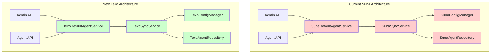
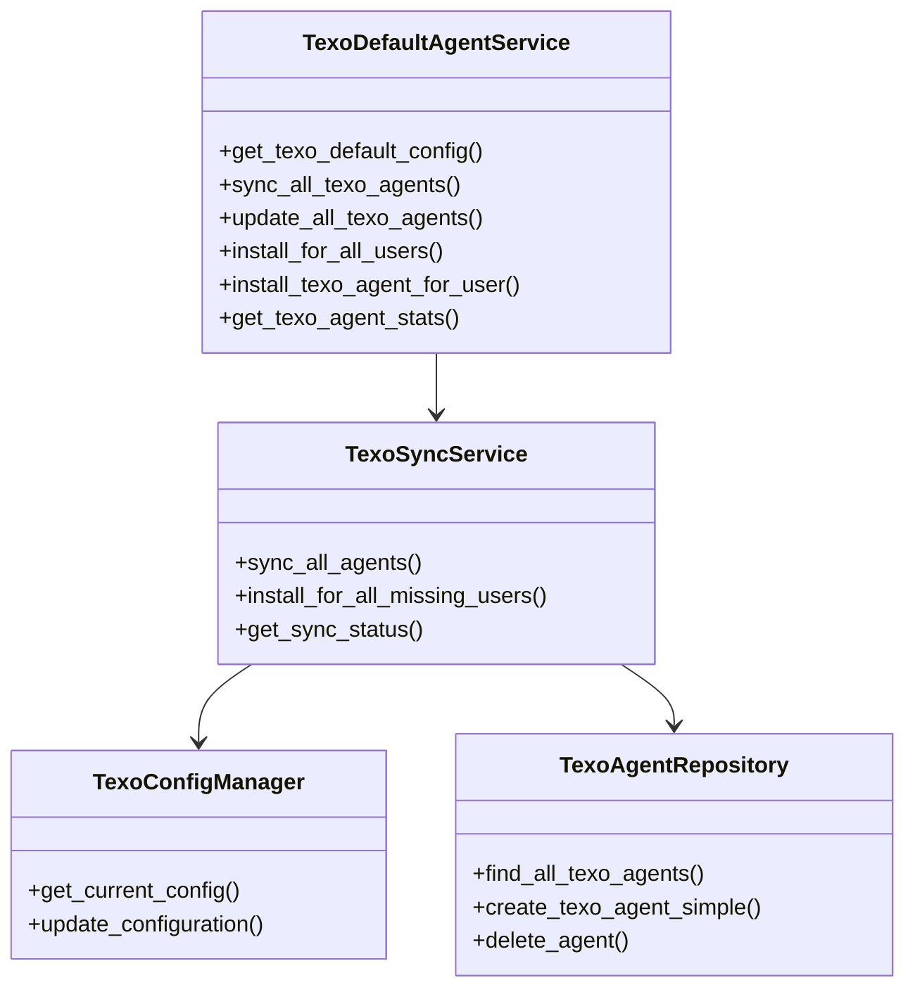
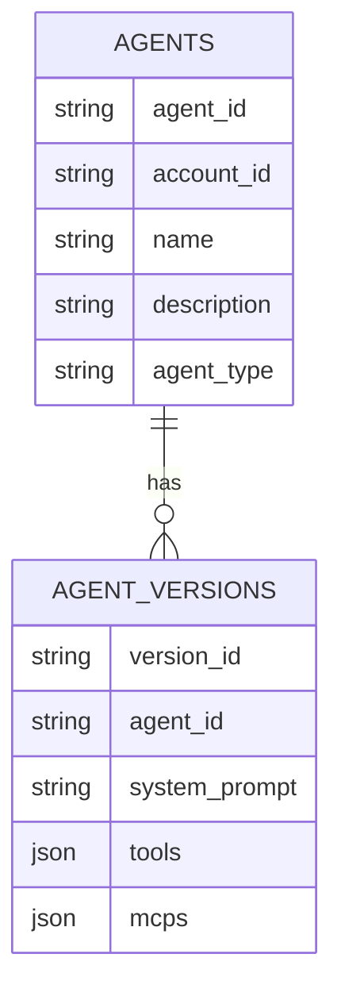

# Rebrand Application: Suna to Texo

## Overview

This design document outlines the comprehensive rebranding initiative to change the flagship AI agent name from "Suna" to "Texo" throughout the DimaticTexo platform. The rebranding encompasses backend services, frontend interfaces, documentation, configuration files, and infrastructure components while maintaining system functionality and preventing breaking changes.

## Scope

The rebranding affects multiple layers of the application:
- **Backend Services**: Agent configuration, API endpoints, service classes, and database operations
- **Frontend Application**: User interfaces, utility functions, and API integrations  
- **Infrastructure**: Docker configurations, network definitions, and container images
- **Documentation**: README files, contribution guidelines, and user-facing content
- **Configuration**: Environment variables, service endpoints, and deployment scripts

## Architecture Impact Analysis

### Backend Service Changes



### Directory Structure Transformation

| Current Path | New Path |
|---|---|
| `backend/agent/suna/` | `backend/agent/texo/` |
| `backend/utils/suna_default_agent_service.py` | `backend/utils/texo_default_agent_service.py` |
| `backend/utils/scripts/manage_suna_agents.py` | `backend/utils/scripts/manage_texo_agents.py` |
| `backend/utils/scripts/suna_manager.py` | `backend/utils/scripts/texo_manager.py` |
| `frontend/src/lib/utils/install-suna-agent.ts` | `frontend/src/lib/utils/install-texo-agent.ts` |

## Backend Service Transformation

### Core Service Classes Rebranding

The backend contains several interconnected service classes that require coordinated renaming:



### API Endpoint Updates

Current API endpoints requiring modification:

| Current Endpoint | New Endpoint | Purpose |
|---|---|---|
| `/admin/suna-agents/install-user/{account_id}` | `/admin/texo-agents/install-user/{account_id}` | Admin agent installation |
| Agent API references to "Suna" | Agent API references to "Texo" | Agent management operations |

### Database and Model Changes

The rebranding involves updating database queries and model references:



**Query Pattern Updates:**
- Agent creation queries for Texo agents
- Agent filtering by name/type containing "Texo"
- Default agent installation logic
- Agent synchronization operations

### Service Integration Points

Services requiring integration updates:

1. **Admin Service** (`backend/admin/api.py`)
   - Import statement updates
   - Service instantiation
   - Logging message updates

2. **Agent Service** (`backend/agent/api.py`)
   - Default agent validation logic
   - Agent update restrictions
   - Error message content

3. **Utility Services**
   - Default agent service references
   - Script and management tool updates

## Frontend Application Changes

### Utility Function Updates

The frontend contains utility functions for agent installation:

```typescript
// Current: install-suna-agent.ts
async function installTexoForNewUser(userId: string) {
    const response = await fetch(`${backendUrl}/admin/texo-agents/install-user/${userId}`, {
        method: 'POST',
        headers: {
            'Content-Type': 'application/json',
            'X-Admin-Api-Key': adminApiKey,
        },
    });
    // Error handling and logging updates
}

export async function checkAndInstallTexoAgent(userId: string, userCreatedAt: string) {
    const installKey = `texo-install-attempted-${userId}`;
    // Implementation with updated references
}
```

### UI Text and Messaging Updates

Areas requiring user-facing text updates:

1. **Agent Names and Descriptions**
   - Default agent display name
   - Agent capability descriptions
   - Help text and tooltips

2. **Error Messages**
   - Agent installation failures
   - Permission restrictions
   - System notifications

3. **Navigation and Menus**
   - Agent selection interfaces
   - Configuration screens
   - Dashboard displays

## Infrastructure and Configuration

### Docker Configuration Updates

Docker Compose modifications required:

```yaml
# Network name update
networks:
  texo-network:
    driver: bridge

services:
  backend:
    networks:
      - texo-network
  
  worker:  
    networks:
      - texo-network
      
  frontend:
    networks:
      - texo-network
      
  redis:
    networks:
      - texo-network
```

### Container Image References

Container image paths requiring updates:
- `ghcr.io/suna-ai/suna-backend:latest` → `ghcr.io/texo-ai/texo-backend:latest`
- Registry namespace migration considerations
- Image build pipeline updates

### Environment Variable Updates

Configuration variables requiring review:
- Service endpoint configurations
- API key references
- Network and service discovery settings

## Documentation Updates

### Core Documentation Files

| File | Update Type | Key Changes |
|---|---|---|
| `README.md` | Content + Links | Agent name, capabilities, GitHub links |
| `CONTRIBUTING.md` | Content | Project references, agent descriptions |
| `backend/README.md` | Title + Content | Service description, usage examples |

### Repository Metadata

GitHub and project metadata updates:
- Repository description
- Tag and release notes
- Issue and PR templates
- Badge and shield references

## Implementation Strategy

### Phase 1: Backend Service Core (High Priority)

1. **Directory and File Migration**
   ```bash
   # Create new directory structure
   mv backend/agent/suna backend/agent/texo
   mv backend/utils/suna_default_agent_service.py backend/utils/texo_default_agent_service.py
   mv backend/utils/scripts/manage_suna_agents.py backend/utils/scripts/manage_texo_agents.py
   mv backend/utils/scripts/suna_manager.py backend/utils/scripts/texo_manager.py
   ```

2. **Class and Service Renaming**
   - Update class names: `SunaDefaultAgentService` → `TexoDefaultAgentService`
   - Update method names: `install_suna_agent_for_user` → `install_texo_agent_for_user`
   - Update import statements throughout backend

3. **API Endpoint Updates**
   - Modify route decorators
   - Update endpoint documentation
   - Maintain backward compatibility if needed

### Phase 2: Frontend Integration (Medium Priority)

1. **Utility Function Updates**
   ```bash
   mv frontend/src/lib/utils/install-suna-agent.ts frontend/src/lib/utils/install-texo-agent.ts
   ```

2. **API Integration Updates**
   - Update endpoint URLs
   - Modify function names and variables
   - Update error messages and logging

3. **User Interface Updates**
   - Agent display names
   - Description text
   - Help documentation

### Phase 3: Infrastructure and Documentation (Low Priority)

1. **Docker Configuration**
   - Update network names
   - Modify image references
   - Update service configurations

2. **Documentation Updates**
   - README and contribution guides
   - Code comments and docstrings
   - API documentation

### Phase 4: Testing and Validation

1. **Import Verification**
   ```python
   # Test all import statements
   from agent.texo import TexoSyncService
   from utils.texo_default_agent_service import TexoDefaultAgentService
   ```

2. **API Endpoint Testing**
   - Verify new endpoint accessibility
   - Test agent installation flow
   - Validate error handling

3. **Database Operation Testing**
   - Agent creation and management
   - Query execution verification
   - Data integrity checks

## Risk Mitigation

### Breaking Change Prevention

1. **Gradual Migration Approach**
   - Implement new services alongside existing ones
   - Use feature flags for controlled rollout
   - Maintain import compatibility during transition

2. **Database Migration Safety**
   - No immediate data migration required
   - Agent records remain unchanged
   - New installations use updated naming

3. **API Backward Compatibility**
   - Consider maintaining old endpoints temporarily
   - Implement redirects or aliases if needed
   - Clear deprecation timeline

### Rollback Strategy

1. **File System Rollback**
   - Maintain backup of original file structure
   - Version control checkpoints at each phase
   - Automated rollback scripts

2. **Configuration Rollback**
   - Environment variable restoration
   - Docker configuration reversion
   - Service endpoint restoration

## Testing Strategy

### Unit Testing Updates

```python
# Example test updates
class TestTexoDefaultAgentService(unittest.TestCase):
    def setUp(self):
        self.service = TexoDefaultAgentService()
    
    def test_install_texo_agent_for_user(self):
        # Test agent installation
        pass
    
    def test_sync_all_texo_agents(self):
        # Test synchronization
        pass
```

### Integration Testing

1. **API Endpoint Testing**
   - New endpoint functionality
   - Error response validation
   - Authentication and authorization

2. **Service Integration Testing**
   - Backend service communication
   - Database operation validation
   - Frontend-backend integration

3. **End-to-End Testing**
   - Complete agent installation flow
   - User interface functionality
   - Cross-service communication

### Validation Checklist

- [ ] All import statements resolve correctly
- [ ] API endpoints respond successfully
- [ ] Database operations execute without errors
- [ ] Frontend integration functions properly
- [ ] Docker services start and communicate
- [ ] Documentation reflects updated naming
- [ ] No broken links or references
- [ ] Error messages display correctly
- [ ] Logging captures updated service names
- [ ] Configuration files load properly

## Conclusion

The rebranding from "Suna" to "Texo" requires coordinated changes across backend services, frontend interfaces, infrastructure configuration, and documentation. The phased implementation approach ensures system stability while methodically updating all references. Proper testing and validation at each phase will prevent breaking changes and maintain system functionality throughout the transition.